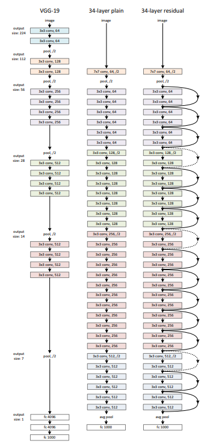
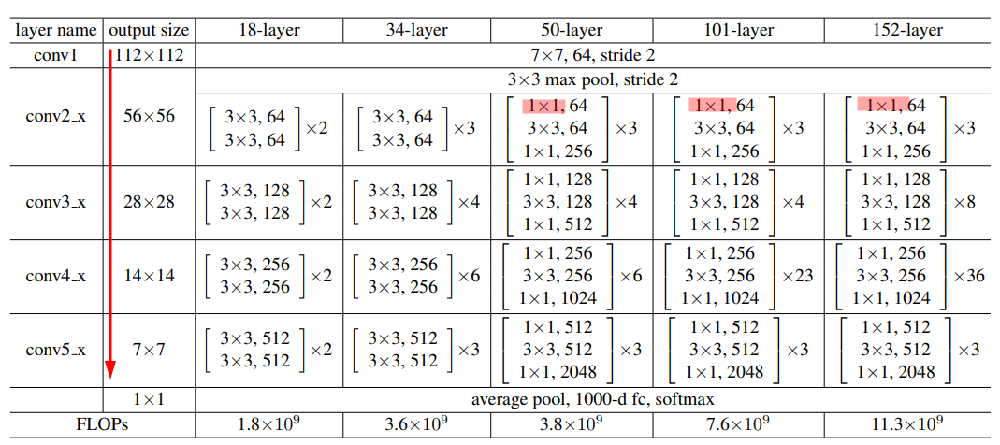

# Resnet-pytorch
[resnet paper](https://arxiv.org/pdf/1512.03385.pdf)

## Residual block
Note that the [resnet paper](https://arxiv.org/pdf/1512.03385.pdf) use the BN after the conv layer, before the activation (as suggessted in the [original BN paper](https://arxiv.org/abs/1502.03167))

## Introduction
This is the pytorch implementation for the resnet-18, for Keras implemenation, please check [ResNet-18-keras](https://github.com/Tsuihao/ResNet-18-keras)

## Environment setting
[install pytorch](https://pytorch.org/?utm_source=Google&utm_medium=PaidSearch&utm_campaign=%2A%2ALP+-+TM+-+General+-+HV+-+GER&utm_adgroup=How+To+Install+PyTorch&utm_keyword=how%20to%20install%20pytorch&utm_offering=AI&utm_Product=PyTorch&gclid=CjwKCAjw_sn8BRBrEiwAnUGJDmAaAqxTSGpC0MGl-Uz1KyXo7LVtSXVPLIUDiwbswOMRgxoAnOr-JRoCPDEQAvD_BwE)

`pip install tensorboard`